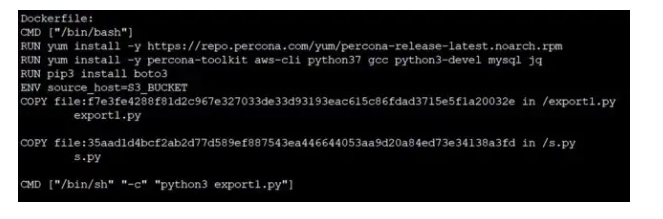

Docker images into Dockerfiles
There are some cases that we need to build Dockerfile using a docker image. Fortunately Docker images are not a blackbox, there are options to inspect the docker image and construct it’s Dockerfile.

We can use a tool called “Whaler” which is designed to reverse engineer docker images into the Dockerfile that created it. This tool is built into a docker image called “alpine/dfimage” so that we can use the tool without any installations locally.

This tool generates a Dockerfile from an Image and it also displays information such as open ports and environment variables.

```
$ alias dfimage="docker run -v /var/run/docker.sock:/var/run/docker.sock --rm alpine/dfimage"
$ dfimage -sV=1.36 /image/that_you_need_to_inspect

ex:
$ dfimage -sV=1.36 madeesha/hello:latest
```

This gives us the Dockerfile


However in above Dockerfile there are some files copied inside and we need to know the file content to create Dockerfile succesfully. We can get the content of those files using the below command,

```
docker run --rm madeesha/hello cat export1.py
```

“ — rm” arg will delete the container once the command run.

Hope this article helps you to reproduce the Dockerfile from a Docker image. Cheers!Í

source: [click](https://faun.pub/docker-images-into-dockerfiles-6b6cdfb0ed7)